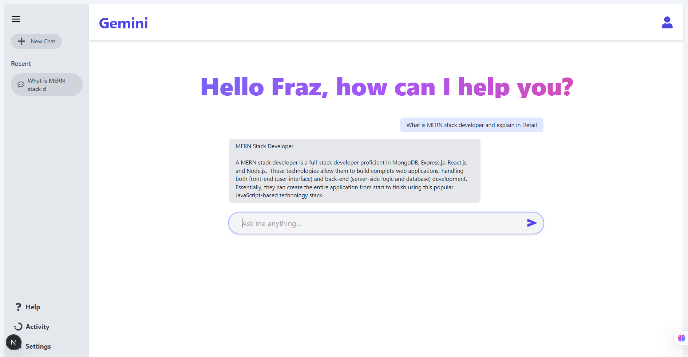

# Gemini Chat Clone 🚀

A responsive and elegant AI chatbot interface built using **Next.js 14 (App Router)** and integrated with **Google Gemini API**. Inspired by Google's Gemini, this clone supports interactive chat, message history, and a polished UI powered by **Tailwind CSS** and **React Icons**.



---

## 🛠 Tech Stack

- **Framework**: [Next.js 14](https://nextjs.org/)
- **Styling**: [Tailwind CSS](https://tailwindcss.com/)
- **Icons**: [React Icons](https://react-icons.github.io/react-icons/)
- **Backend/API**: Google Gemini 1.5 Flash via [Gemini API](https://ai.google.dev/)
- **Language**: JavaScript / JSX
- **Deployment**: Vercel (Recommended)

---

## ✨ Features

- 🔒 Server-side API routing via `app/api/chat/route.js`
- 📜 Chat history with local state (New Chat & Recent)
- 💬 Real-time messaging with Gemini
- 🌙 Responsive UI (Mobile + Desktop)
- ⚡ Loading indicator during Gemini's response
- 📎 Clean, markdown-free, concise AI responses

---

## 📂 Folder Structure

```
gemini-clone/
├── src/
│   ├── app/
│   │   ├── page.jsx              # Main entry
│   │   └── api/
│   │       └── chat/route.js     # Gemini API handler
│   ├── components/
│   │   └── ChatPage.jsx          # Full Chat UI
│   └── styles/                   # Tailwind configs (optional)
├── public/
├── .env.local                    # Gemini API Key
└── tailwind.config.js            # Tailwind setup
```

---

## ⚙️ Getting Started

### 1. Clone the Repo

```bash
git clone https://github.com/yourusername/gemini-clone.git
cd gemini-clone
```

### 2. Install Dependencies

```bash
npm install
# or
yarn install
```

### 3. Set Up Environment Variable

Create a `.env.local` file at the root of the project:

```env
GEMINI_API_KEY=your_gemini_api_key_here
```

> 🔑 Get your API key from: [ai.google.dev](https://ai.google.dev/)

### 4. Run the Dev Server

```bash
npm run dev
# or
yarn dev
```

Visit `http://localhost:3000` to interact with your chatbot.

---

## 📦 Deploying on Vercel

1. Push your code to GitHub
2. Go to [vercel.com](https://vercel.com)
3. Import your project from GitHub
4. Set `GEMINI_API_KEY` in **Project Settings > Environment Variables**
5. Deploy 🎉

---

## ✅ To-Do (Future Enhancements)

- Save & load chat history with localStorage or a database
- Add user authentication
- Improve formatting of AI replies (e.g., with syntax highlighting)
- Add voice-to-text or speech synthesis features
- Enable markdown rendering (optional)

---

## 📄 License

This project is open-sourced under the MIT License.

---

## 🤝 Credits

Inspired by Google’s Gemini UI and powered by the official Gemini API.

---

> Made with ❤️ by [Your Name](https://github.com/yourusername)